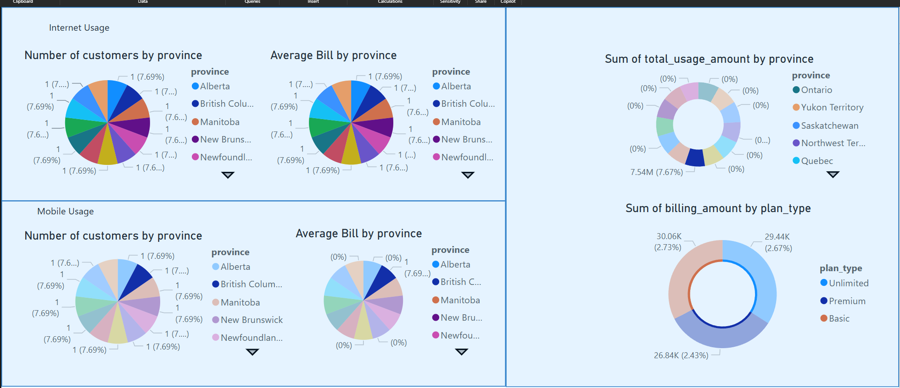

# Introduction

When designing the initial schemas for the tables, realizing that in telecom there is multiple aspects of usages from cellular to home internet to payphones

For this particular example choose 3 particular large components Customer, Billing and Usage

I went a step further to even create 2 seperate usages for home internet and cellular. This could have be done with the same entity or table however choosing 2 seperate makes it cleaner for information gathering in terms of service type for cellular and the kind of usuage amount for each.

# Customer

## Customer Schema

Customer Table Schema
Attribute | Data Type | Description
------------------|-----------|----------------------------------
customer_id | INT | Primary key, auto-incremented.
first_name | VARCHAR | Customer's first name.
last_name | VARCHAR | Customer's last name.
date_of_birth | DATE | Customer's date of birth.
email | VARCHAR | Customer's email address.
phone_number | VARCHAR | Customer's contact number.
address_line1 | VARCHAR | First line of the customer's address.
address_line2 | VARCHAR | Second line of the customer's address (optional).
city | VARCHAR | City of the customer's address.
state_province | VARCHAR | State or province of the customer's address.
postal_code | VARCHAR | Postal or ZIP code of the customer's address.
country | VARCHAR | Country of the customer's address.
activation_date | DATE | Date when the customer was activated.

## Customer Schema Discussion

Most of the required are here where the customer is from to the detail of province. The reason for a schema with such specific fields instead of a blanket "address" to retrieve uniformed information at this stage.
Adding activation date and date of birth to use later for business cases on how long customers stay with the company and what are the age groups as well as email address for marketing purposes.

# Billing

## Billing Schema

Billing Table Schema
Attribute | Data Type | Description
-------------------|-----------|----------------------------------
billing_id | INT | Primary key, auto-incremented.
customer_id | INT | Foreign key, references Customers.
billing_amount | DECIMAL | Amount billed to the customer.
billing_date | DATE | Date when the bill was generated.
due_date | DATE | Payment due date.
payment_status | VARCHAR | Status of the payment (e.g., paid, due).
plan_type | VARCHAR | Type of plan (e.g., Basic, Premium, Unlimited).
latest_billed_date | DATE | Date of the most recent billing.

## Billing Schema Discussion

The billing

# Usage

# Cellular Usage

Cellular Service Usage Table Schema
Attribute | Data Type | Description
------------------|-----------|----------------------------------
usage_id | INT | Primary key, auto-incremented.
customer_id | INT | Foreign key, references Customers.
service_type | VARCHAR | Type of service (e.g., call, SMS, data).
usage_amount | DECIMAL | Amount of usage (e.g., minutes, messages, MBs).
usage_date | DATE | Date of usage.
usage_time | TIME | Time of usage.

# Internet Usage

Home Internet Usage Table Schema
Attribute | Data Type | Description
------------------|-----------|----------------------------------
usage_id | INT | Primary key, auto-incremented.
customer_id | INT | Foreign key, references Customers.
data_usage_amount | DECIMAL | Amount of data used (in MBs/GBs).
usage_date | DATE | Date of usage.
usage_time | TIME | Time of usage.

# Dashboard Visualization

# Persona Discussion on Schema Design

## Data Producers

## Data Engineers

## Data Consumers
