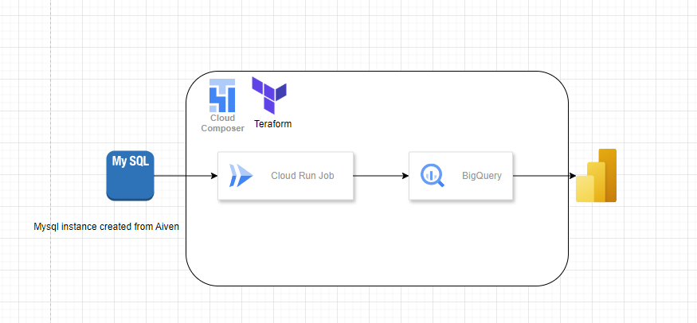

# **Data Ingestion and Storage on Google Cloud Platform (GCP)**

This document outlines the data ingestion and storage architecture implemented for this assignment. It includes a comparison of **Cloud Dataproc**, **Cloud Dataflow**, **Cloud Run Jobs**, **BigQuery**, and **Cloud Storage**, along with the rationale behind the chosen services.

---

## **Table of Contents**

1. [Data Ingestion: Comparison of Dataproc, Dataflow, and Cloud Run Jobs](#data-ingestion-comparison-of-dataproc-dataflow-and-cloud-run-jobs)
   - [Cloud Dataproc](#cloud-dataproc)
   - [Cloud Dataflow](#cloud-dataflow)
   - [Cloud Run Jobs](#cloud-run-jobs)
   - [Cost Comparison Summary](#cost-comparison-summary)
   - [Why I Chose Cloud Run Jobs](#why-i-chose-cloud-run-jobs)
2. [Data Processing: BigQuery vs. Cloud SQL](#data-processing-bigquery-vs-cloud-sql)
   - [Comparison Summary](#comparison-summary)
   - [Why I Chose BigQuery](#why-i-chose-bigquery)
3. [Data Storage: BigQuery and Google Cloud Storage](#data-storage-bigquery-and-google-cloud-storage)
   - [BigQuery](#bigquery)
   - [Cloud Storage](#cloud-storage)
   - [Comparison Summary](#comparison-summary-1)
   - [Why BigQuery + Cloud Storage is a Great Combo](#why-bigquery--cloud-storage-is-a-great-combo)
4. [Implementation for This Assignment](#implementation-for-this-assignment)

---

## **Data Ingestion: Comparison of Dataproc, Dataflow, and Cloud Run Jobs**

### **Cloud Dataproc**

- **Pricing Model**: Pay for cluster resources (VMs, storage, and networking).
- **Costs**: Depend on cluster size, runtime, and node types.
- **Example Cost**:
  - A small cluster (1 master + 2 worker nodes, `n1-standard-4` machines):
    - VM costs: $0.95/hour.
    - Persistent disk storage: $0.04/GB/month.
  - For a 10-hour job: ~$9.50 (VM costs) + storage costs.
- **Best For**: Large-scale, complex workloads requiring Hadoop/Spark.

---

### **Cloud Dataflow**

- **Pricing Model**: Pay for vCPU, memory, and storage used during pipeline execution.
- **Costs**: Streaming jobs cost more than batch jobs.
- **Example Cost**:
  - Batch job processing 1 TB of data:
    - $0.026/vCPU hour + $0.0035/GB hour for memory.
    - Total cost: ~$10–$20 for a typical job.
  - Streaming jobs: ~2x the cost of batch jobs.
- **Best For**: Complex ETL, large-scale, or real-time processing.

---

### **Cloud Run Jobs**

- **Pricing Model**: Pay for vCPU and memory used during job execution. No cost when the job is not running.
- **Example Cost**:
  - A job using 1 vCPU and 2 GB of memory running for 1 hour:
    - $0.024 (vCPU) + $0.0025 (memory) = $0.0265/hour.
  - For a job that runs daily for 1 hour: ~$0.80/month.
- **Best For**: Simple, periodic, or event-driven tasks.

---

### **Cost Comparison Summary**

| Service            | Example Cost (1-hour job)   | Best For                                      |
| ------------------ | --------------------------- | --------------------------------------------- |
| **Cloud Dataproc** | ~$9.50 (small cluster)      | Large-scale, complex Hadoop/Spark workloads.  |
| **Cloud Dataflow** | ~$10–$20 (1 TB batch job)   | Complex ETL, large-scale, or real-time tasks. |
| **Cloud Run Jobs** | ~$0.0265 (1 vCPU, 2 GB RAM) | Simple, periodic, or event-driven tasks.      |

---

### **Why I Chose Cloud Run Jobs**

For this assignment, **Cloud Run Jobs** was chosen because:

- **No Streaming**: Data ingestion is batch-based, not real-time.
- **Not Complex**: The task involves simple data movement from MySQL to BigQuery without complex transformations.
- **Cost-Effective**: At ~$0.0265/hour, it’s the most affordable option for small to medium-scale tasks.
- **Ease of Use**: Easy to set up and run containerized tasks without managing infrastructure.
- **Log Visibility**: Logs are easy to monitor and debug in Google Cloud Logging.

**Cloud Dataproc** and **Cloud Dataflow** were considered but deemed overkill for this use case.

---

## **Data Processing: BigQuery vs. Cloud SQL**

### **Comparison Summary**

| Feature             | BigQuery                                | Cloud SQL                                              |
| ------------------- | --------------------------------------- | ------------------------------------------------------ |
| **Scalability**     | Petabyte-scale, serverless              | Scales vertically (limited by instance size).          |
| **Cost**            | $0.02/GB storage, $5/TB queries         | ~$11/month (instance) + $0.17/GB storage.              |
| **Ease of Use**     | SQL-based, no infrastructure management | SQL-based, fully managed but requires instance sizing. |
| **Maintainability** | Fully managed, no tuning required       | Fully managed, but requires backups and scaling.       |
| **Use Case**        | Analytics, data warehousing             | Transactional workloads, relational data.              |

---

### **Why I Chose BigQuery**

For this assignment, **BigQuery** was chosen because:

- **Scalability**: Handles large datasets effortlessly.
- **Cost-Effective**: Pay only for storage and queries, with no upfront costs.
- **Ease of Use**: Fully managed and requires no infrastructure tuning.
- **Analytics**: Optimized for complex queries and data analysis.

**Cloud SQL** was considered but is better suited for transactional workloads or applications requiring relational databases.

---

## **Data Storage: BigQuery and Google Cloud Storage**

### **BigQuery**

- **Best For**: Data warehousing, large-scale analytics, and ad-hoc queries.
- **Strengths**:
  - Fully managed, serverless, and highly scalable.
  - Optimized for OLAP (Online Analytical Processing).
  - Supports SQL and integrates with BI tools.
- **Max Storage**: No fixed limit; scales automatically.
- **Cost**:
  - Storage: $0.02/GB/month (active) or $0.01/GB/month (long-term).
  - Querying: $5/TB scanned (first 1 TB free per month).
- **Example**: Storing 1 TB and querying 100 GB/month = ~$7/month.
- **External Tables**: Can connect to Cloud Storage for infrequently accessed data.

---

### **Cloud Storage**

- **Best For**: Object storage, file storage, and data archiving.
- **Strengths**:
  - Highly scalable and durable object storage.
  - Supports multiple storage classes (e.g., Standard, Nearline, Coldline).
  - Ideal for unstructured data (e.g., images, videos, logs).
- **Max Storage**: No fixed limit; designed for massive scalability.
- **Cost**:
  - Standard Storage: $0.02/GB/month.
  - Nearline Storage: $0.01/GB/month (minimum 30 days).
  - Coldline Storage: $0.004/GB/month (minimum 90 days).
- **Example**: Storing 1 TB in Standard Storage = ~$20/month.

---

### **Comparison Summary**

| Feature             | BigQuery                                                     | Cloud Storage                              |
| ------------------- | ------------------------------------------------------------ | ------------------------------------------ |
| **Scalability**     | Petabyte-scale, serverless                                   | Exabyte-scale, highly scalable.            |
| **Max Storage**     | No fixed limit (petabytes+).                                 | No fixed limit (exabytes+).                |
| **Cost**            | $0.02/GB storage, $5/TB queries                              | $0.02/GB (Standard), cheaper for archival. |
| **External Tables** | Can connect to Cloud Storage for infrequently accessed data. | N/A (used as a data source).               |
| **Ease of Use**     | SQL-based, no infrastructure management                      | Simple API, no query capabilities.         |
| **Maintainability** | Fully managed, no tuning required                            | Fully managed, lifecycle policies.         |
| **Use Case**        | Analytics, data warehousing                                  | File storage, backups, archiving.          |

---

### **Why BigQuery + Cloud Storage is a Great Combo**

- **Cost-Effective for Infrequent Access**:
  - Store data in Cloud Storage (e.g., Nearline or Coldline for lower costs).
  - Connect it to BigQuery as an external table.
  - Pay only for storage and querying when needed, avoiding BigQuery's active storage costs.
- **Flexibility**:
  - Use BigQuery for analytics on frequently accessed data.
  - Use Cloud Storage for archival or infrequently accessed data.

---

## **Implementation for This Assignment**

For this assignment, the following architecture was implemented:

1. **Data Ingestion**: Cloud Run Jobs were used for batch-based data movement from MySQL to BigQuery.
2. **Data Processing**: BigQuery was used for analytics and complex queries.
3. **Data Storage**:
   - Frequently accessed data was stored in BigQuery.
   - Infrequently accessed data was stored in Cloud Storage and connected to BigQuery as an external table.

This combination provided a cost-effective, scalable, and maintainable solution for the assignment's requirements.

---
